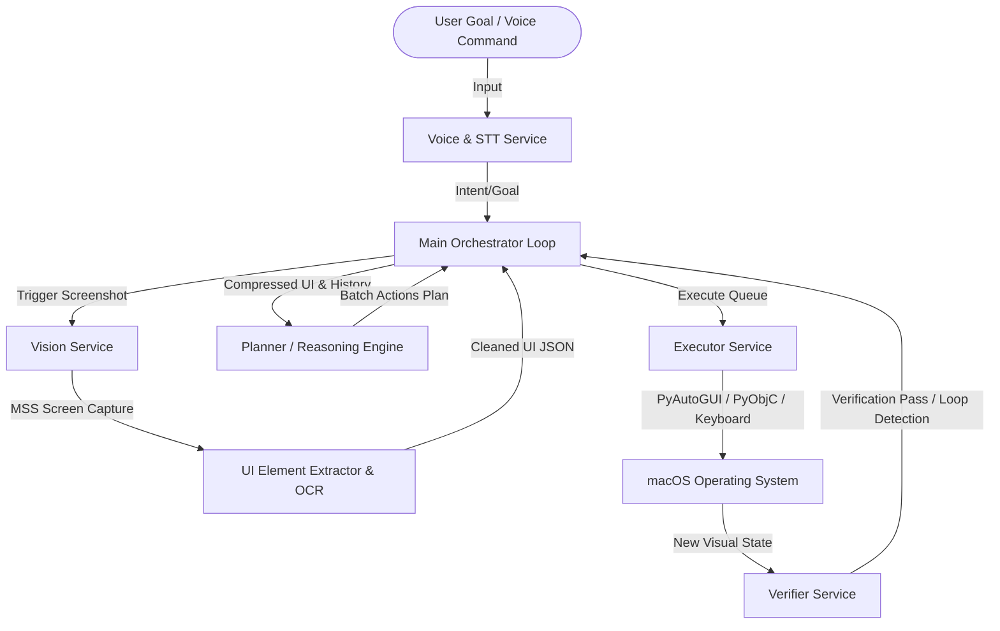

# ComputerUse: Fully Autonomous macOS Desktop Agent 🤖🖥️

An advanced, fully autonomous desktop execution agent for macOS. It integrates visual comprehension, real-time speech interaction, cognitive planning, OS-level interaction control, and state verification loops.

---

## 🏗️ Architecture



The system is built on a four-service architecture to maximize efficiency, reliability, and human-like execution:
1. **Vision Service (`vision_service`)**: Captures high-fidelity screenshots, performs OCR/layout analysis, and extracts structured lists of elements.
2. **Planner Service (`planner_service`)**: Processes goals and visual state payloads via advanced LLM providers (NVIDIA API / Ollama) to output structured JSON action plans.
3. **Executor Service (`executor_service`)**: Translates LLM action outputs into OS-level keystrokes, shortcuts, mouse clicks, and application focus, with coordinate caching and UI compression to optimize speed.
4. **Verifier Service (`verifier_service`)**: Dynamically checks post-execution states against the target goal, tracking completion progress, detecting loops, and triggering recovery recommendation procedures.

---

## ✨ Features

- 🏎️ **Optimized Loop Control**: Minimizes API calls by performing single screenshot captures per iteration and batching execution plans.
- ⚡ **Coordinate Caching**: Element caches store discovered UI bounding boxes to skip repeated coordinate rediscovery.
- 📦 **UI Compression**: Compresses dense screens down to a 40-element cap for LLMs, avoiding token bloat and latency.
- 🎙️ **Voice Interaction Support**: Voice command capturing (STT via Whisper) and speech synthesis response feedback (Piper TTS).
- 🛡️ **Safety & Verification Loop**: Validates execution results at the end of each action batch, verifying that the interface matches expectations before continuing or exiting.
- 🔒 **Secure Environment Config**: Uses dotenv to manage model parameters, server ports, and secret tokens safely.

---

## 🚀 Setup & Installation

### 1. Prerequisites
Ensure you have Python 3.10+ installed on your macOS machine.

### 2. Clone and Install Dependencies
Navigate into the repository, create a virtual environment, and install dependencies:

```bash
cd ComputerUse
python3 -m venv .venv
source .venv/bin/activate
pip install -r agent/requirements.txt
```

### 3. Environment Setup
Create a `.env` file in the root directory to store your tokens and provider configurations:

```ini
NVIDIA_API_KEY=your_nvidia_api_key_here
```

> [!WARNING]
> Your `.env` contains secret API keys. The project is configured with a `.gitignore` to prevent committing or pushing this file to any public remote. Never share your `.env` file.

---

## 💻 Running the Agent

Start the main orchestrator script using the project's virtual environment:

```bash
cd agent
PYTHONPATH=. ../.venv/bin/python -m executor_service.main
```

### Main Prompt Control
- **Text Command**: Directly type your goal (e.g. `create an essay about paris for 500 words in google docs`) and hit **Enter**.
- **Voice Command**: Type `v`, hit **Enter**, speak your goal, and release to let the system transcribe and run the task autonomously.
- **Exit**: Type `exit` or `quit`.
- **Interruption**: Press **ESC** at any time to immediately interrupt and halt execution.