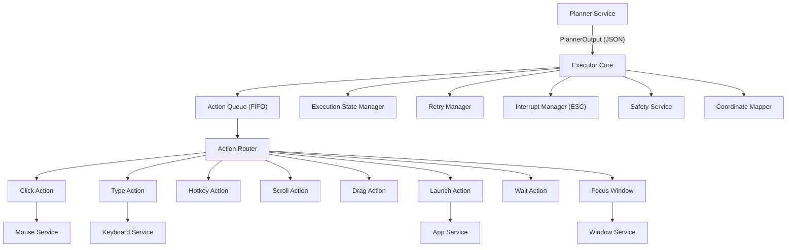

# Phase 4 — Executor Service Walkthrough

## Overview

The Executor Service is a fully standalone, deterministic action execution engine. It receives structured action plans from the Planner Service and physically controls the desktop (mouse, keyboard, apps) via PyAutoGUI on macOS.

**Key principle:** The Executor never reasons. It only acts. Planner outputs INTENT → Executor performs MECHANICAL ACTIONS.

---

## Architecture



---

## File Structure (28 files)

```
executor_service/
├── __init__.py
├── main.py                    # Entry point with demo plan
├── executor.py                # Core orchestrator
├── action_router.py           # Routes action_type → handler
├── action_queue.py            # Async FIFO with priority/pause/cancel
├── execution_state.py         # JSON-file persistent task state
├── task_context.py            # Holds user goal until completion
├── coordinate_mapper.py       # Quartz screen bounds validation
├── interrupt_manager.py       # ESC key listener via pynput
├── retry_manager.py           # Exponential backoff retries
├── schemas.py                 # ExecutorActionInput, ExecutionResult, TaskState
├── config.py                  # All tuning knobs
├── requirements.txt
│
├── actions/
│   ├── click_action.py        # click, double_click, right_click
│   ├── type_action.py         # type with unicode clipboard fallback
│   ├── hotkey_action.py       # keyboard shortcuts
│   ├── scroll_action.py       # scroll up/down at position
│   ├── drag_action.py         # click-and-drag
│   ├── launch_action.py       # macOS open -a
│   ├── wait_action.py         # async sleep
│   └── focus_window_action.py # AppleScript activate
│
├── services/
│   ├── mouse_service.py       # Low-level pyautogui mouse
│   ├── keyboard_service.py    # Low-level pyautogui keyboard
│   ├── app_service.py         # Launch/focus/kill via osascript
│   ├── window_service.py      # Quartz/AppKit window tracking
│   └── safety_service.py      # Dangerous action filter
│
└── outputs/
    ├── logs/
    ├── action_history/        # Per-task JSON execution logs
    └── task_state/            # Persistent task state files
```

---

## Execution Flow

For every action received from the Planner:

1. **Enqueue** → Action is placed in the FIFO queue
2. **Dequeue** → Next action is pulled (priority actions first)
3. **Validate Coordinates** → CoordinateMapper checks screen bounds
4. **Safety Check** → SafetyService classifies LOW/MEDIUM/HIGH risk
5. **Route** → ActionRouter maps `action_type` to the correct handler
6. **Execute with Retry** → RetryManager wraps execution with exponential backoff
7. **Update State** → ExecutionStateManager persists success/failure to JSON
8. **Interrupt Check** → InterruptManager checks for ESC between every action

---

## Safety System

| Level | Behavior |
|-------|----------|
| **LOW** | Auto-execute silently |
| **MEDIUM** | Log warning, proceed |
| **HIGH** | Block + require user confirmation via Rich prompt |

Blocked keywords: `sudo`, `rm -rf`, `delete`, `payment`, `purchase`, `checkout`, `password`, `credential`, `shutdown`, `reboot`

---

## Supported Actions

| Action | Handler | Service |
|--------|---------|---------|
| `click` | click_action.py | MouseService |
| `double_click` | click_action.py | MouseService |
| `right_click` | click_action.py | MouseService |
| `type` | type_action.py | KeyboardService |
| `hotkey` | hotkey_action.py | KeyboardService |
| `scroll` | scroll_action.py | MouseService |
| `drag` | drag_action.py | MouseService |
| `launch_app` | launch_action.py | AppService |
| `wait` | wait_action.py | asyncio.sleep |
| `focus_window` | focus_window_action.py | WindowService |

---

## Verification

All 28 modules import and initialize without errors:

```
--- All Executor Service modules imported successfully ---
Supported actions: ['click', 'double_click', 'right_click', 'type', 'hotkey',
                    'scroll', 'drag', 'launch_app', 'wait', 'focus_window']
Screen: 1470x956
Goal active: True | Goal: Open Spotify and play Interstellar theme

✅ Executor Service: ALL MODULES VERIFIED
```

---

## How to Run

```bash
# Demo execution (opens Safari and navigates to Google):
cd /Users/deepandee/Desktop/ComputerUse/agent
PYTHONPATH=. .venv/bin/python -m executor_service.main
```

**Emergency stops:**
- Press **ESC** → immediate halt via InterruptManager
- Move mouse to **any screen corner** → PyAutoGUI FailSafe abort
